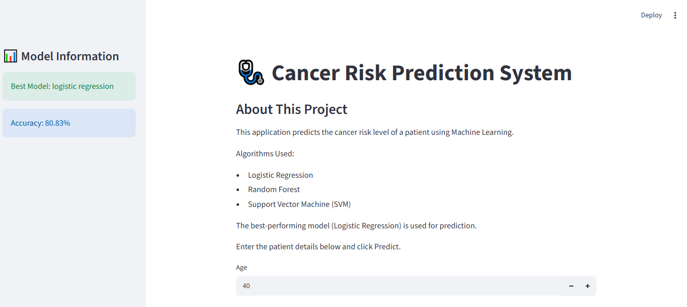
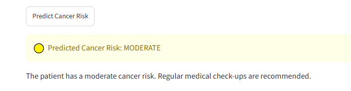
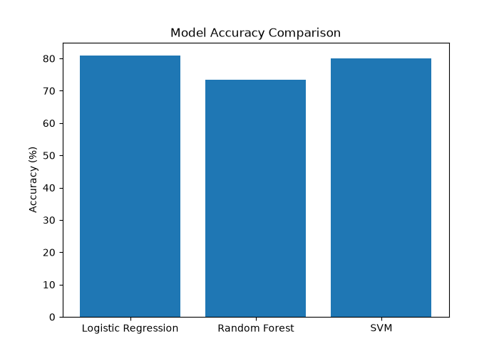
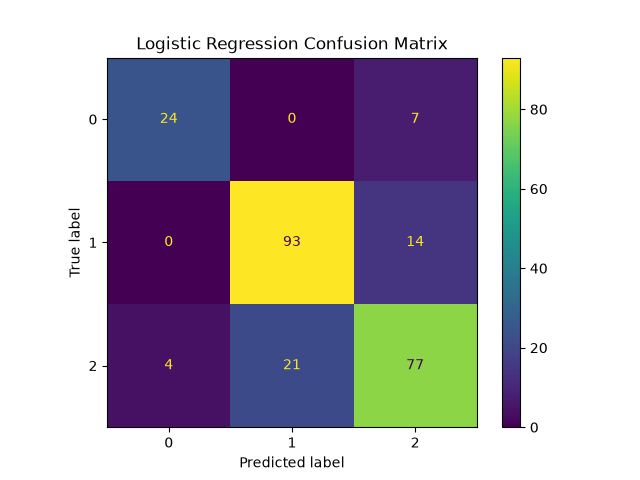
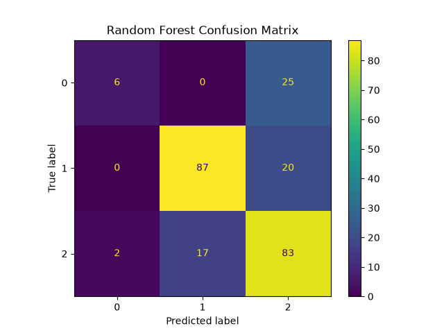
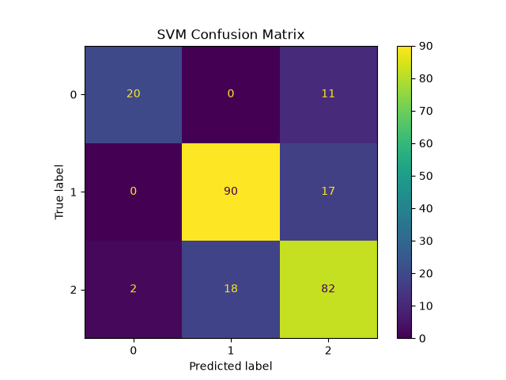

# 🩺 Cancer Risk Prediction System

A Machine Learning-based web application developed using **Python**, **Scikit-learn**, and **Streamlit** to predict a patient's cancer risk based on health-related information.

---

## 🌐 Live Demo

👉 **https://cancer-risk-prediction-system-bjkdfg8kwq3byplkezmfmj.streamlit.app/**

---

## 💻 GitHub Repository

👉 **https://github.com/nawaalwaleed7-ux/Cancer-Risk-Prediction-System**

---

# 📖 Project Overview

The Cancer Risk Prediction System is a machine learning application that predicts a patient's cancer risk using health-related features. The project includes data preprocessing, model training, prediction, and deployment as an interactive web application using Streamlit.

This project was developed as part of my BS Bioinformatics studies to strengthen my understanding of Machine Learning, Data Analysis, and Python application development.

---

# ✨ Features

- Predicts cancer risk using Machine Learning
- Interactive web interface built with Streamlit
- Patient information input form
- Data preprocessing before prediction
- Multiple Machine Learning models trained and evaluated
- Online deployment using Streamlit Community Cloud

---

# 🛠 Technologies Used

- Python
- Streamlit
- Scikit-learn
- Pandas
- NumPy
- Matplotlib
- Joblib

---

# 🤖 Machine Learning Models

The following models were trained and evaluated:

- Logistic Regression
- Random Forest
- Support Vector Machine (SVM)

The best-performing model is used for prediction in the application.

---

# 📊 Model Performance

The best model achieved an accuracy of approximately **80.83%**.

Performance evaluation includes:

- Confusion Matrix
- Accuracy Comparison
- Model Evaluation Metrics

---

# 📸 Application Screenshots

## Home Page



---

## Prediction Result



---

## Model Accuracy Comparison



---

## Logistic Regression Confusion Matrix



---

## Random Forest Confusion Matrix



---

## SVM Confusion Matrix



---

# 🚀 How to Run the Project

### Clone the repository

```bash
git clone https://github.com/nawaalwaleed7-ux/Cancer-Risk-Prediction-System.git
```

### Move into the project folder

```bash
cd Cancer-Risk-Prediction-System
```

### Install dependencies

```bash
pip install -r requirements.txt
```

### Run the application

```bash
streamlit run app.py

---


## 📂 Project Structure

```
Cancer-Risk-Prediction-System
│
├── app.py
├── requirements.txt
├── README.md
│
├── models/
│   ├── logistic_regression.pkl
│   ├── random_forest.pkl
│   ├── svm.pkl
│   └── preprocessor.pkl
│
├── interface.png
├── result.png
├── model_accuracy.png
├── Logistic_Regression_CM.png
├── Random_Forest_CM.png
└── SVM_CM.png


# 🎯 Future Improvements

- Improve model accuracy using advanced algorithms.
- Add more medical features.
- Deploy using Docker.
- Connect to a database.
- Add user authentication.
- Generate downloadable prediction reports.


# 👩‍💻 Author

**Nawal Waleed**

**BS Bioinformatics Student**

Government Post Graduate College (GPGC) Mandian

GitHub:
https://github.com/nawaalwaleed7-ux

LinkedIn:
https://www.linkedin.com/in/nawalwaleed/


## ⭐ If you found this project useful, consider giving it a star on GitHub.

